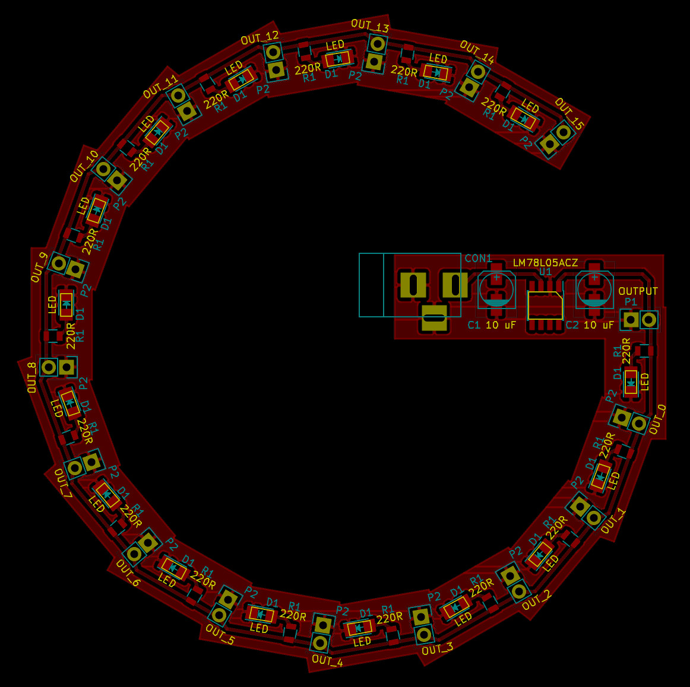

# KiCad_PCBmerge

A Python module for merging multiple KiCad PCBs

By using this module you can merge multiple KiCad PCBs by aligning them at a common part.
For example for merging a addon board to a base board and align them at a pin header use the following steps.

1. Create a KiCad PCB for the base PCB and add a pin header where the addon board shall be connected.
2. Change the value of the pin header to a specific value, for example OUTPUT.
2. Create a second PCB for the addon board and add a pin header for example with the name INPUT, too.
3. Download the pcbmerge.py and create a Python script with the following content

        #!/usr/bin/env python

        from pcbnew import *
        import pcbmerge

        # Load the power board
        mypcb = LoadBoard("NAME_OF_THE_BASE.kicad_pcb")

        # Merge the power board with the led board
        pcbmerge.merge(pcb = mypcb,
                       base_anchor = "OUTPUT",
                       addon_anchor = "INPUT",
                       filename = "NAME_OF_THE_ADDON.kicad_pcb")

        # Combine and refill areas
        pcbmerge.combine_all_areas(mypcb)
        pcbmerge.fill_all_areas(mypcb)

        # Save output
        SaveBoard("simple.kicad_pcb", mypcb)

4. Execute the script and open the simple.kicad_pcb

# License

This is free and unencumbered software released into the public domain.

Anyone is free to copy, modify, publish, use, compile, sell, or
distribute this software, either in source code form or as a compiled
binary, for any purpose, commercial or non-commercial, and by any
means.

In jurisdictions that recognize copyright laws, the author or authors
of this software dedicate any and all copyright interest in the
software to the public domain. We make this dedication for the benefit
of the public at large and to the detriment of our heirs and
successors. We intend this dedication to be an overt act of
relinquishment in perpetuity of all present and future rights to this
software under copyright law.

THE SOFTWARE IS PROVIDED "AS IS", WITHOUT WARRANTY OF ANY KIND,
EXPRESS OR IMPLIED, INCLUDING BUT NOT LIMITED TO THE WARRANTIES OF
MERCHANTABILITY, FITNESS FOR A PARTICULAR PURPOSE AND NONINFRINGEMENT.
IN NO EVENT SHALL THE AUTHORS BE LIABLE FOR ANY CLAIM, DAMAGES OR
OTHER LIABILITY, WHETHER IN AN ACTION OF CONTRACT, TORT OR OTHERWISE,
ARISING FROM, OUT OF OR IN CONNECTION WITH THE SOFTWARE OR THE USE OR
OTHER DEALINGS IN THE SOFTWARE.

For more information, please refer to <http://unlicense.org>

